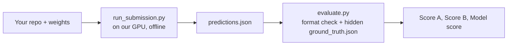

# WIUT Hackathon 2026 — Computer Vision Track: Elimination Task

> Transcribed from the organizer PDF `WIUT Hackathon _ CV Track Elimination Task.pdf` (received 2026-09-23). Wording is kept verbatim; only layout was converted to Markdown. If this file and the PDF disagree, the PDF wins. Rule changes announced in the hackathon channel must be added under "FAQ" with the date.

## Overview

Build a system that watches a fixed road camera, reports every traffic event it sees as a time segment with a class, and raises an alarm before an accident happens.

The camera is a fixed CCTV view of a road (one angle, no camera motion). You receive a few sample videos from it and no labels. We keep a hidden test set of other videos from the same camera and angle, annotated by us. Your solution runs offline on our machine against that set.

The challenge has two parts:

- **Part A — Event detection (mandatory).** Given an `.mp4`, return a list of events `[start_sec, end_sec, label]`. This is the core task.
- **Part B — Accident anticipation (bonus).** Given frames one by one, return a risk score at every frame that an accident is about to start. Only past frames may be used.

A team submits three things:

1. A repository with code, model weights, and a one-command entry point that implements the interface in *Output format & interface*.
2. A public team website with the team, the approach, EDA of the sample videos, visualizations of your results, and a live demo where a visitor uploads a video and gets the events back, visualized.
3. A short technical report (a page on the website is fine): what you built, what worked, what did not.

We score the model on the hidden set with the published `evaluate.py`, then combine it with the website and code-quality scores (see *Evaluation & scoring*). Teams of three; one submission per team.

## Part A — Traffic event detection

Given the path to one `.mp4`, return every traffic event in it as `[start_sec, end_sec, label]`.

- **Input:** a path to an `.mp4` file from the camera. You may read the file any way you like (random access, multiple passes, clip sampling). Typical clips are several minutes long at 25 fps.
- **Output:** a Python list of lists. `start_sec` and `end_sec` are floats in seconds from the first frame, `0 <= start_sec < end_sec <= duration`. `label` is one of the official class ids from *Event classes*.
- One event = one contiguous segment with one class. Two things happening at once are two separate entries. The same class can occur many times in a video; a video may contain no events at all (return `[]`).
- Segments of the same class must not overlap. Segments of different classes may overlap (a `wrong_way` vehicle causing an `accident` is two events).
- Precision of boundaries matters: we match your segments to ours by temporal IoU, so an event you report as the whole minute around a 5-second crash does not count.

Any approach is allowed: a detector plus tracker with hand-written rules, a fine-tuned video model trained on public data, a vision-language model with open weights, or a mix. What we evaluate is the output list, not the method.

## Part B — Accident anticipation (bonus)

At every frame, output the probability that an `accident` will start within the next 5 seconds, using only the frames seen so far.

- **Interface:** a class `RiskEstimator` with `reset(meta)` and `step(frame, t_sec) -> float`. Our harness opens the video, calls `reset` once, then calls `step` for every frame in order and records the returned score. Your estimator never opens the video file itself; that is what makes the score causal.
- **Score:** a float in `[0, 1]`. Higher means an accident is more likely to begin soon. The horizon is fixed: `H = 5 s`.
- **Frames:** `frame` is a BGR `uint8` array of shape `(height, width, 3)` (OpenCV convention); `t_sec` is the frame timestamp in seconds. `meta` gives `fps`, `width`, `height`, `n_frames`, `video_id`.
- **Speed:** `step` is called for every frame, so keep it light. Skipping frames internally and returning the last score is fine. The time budget in *Evaluation & scoring* covers Part A and Part B together.
- Part B is scored only against `accident` events. Other classes are ignored here.

Good anticipation signals do not need a trained accident model: time-to-collision between tracked vehicles, sudden braking, wrong-way or red-light trajectories, and pedestrians entering the roadway all raise the risk before the impact. A team that skips Part B simply leaves the default `RiskEstimator` in place and receives 0 for it.

## Event classes

Use these 14 label ids exactly; all of them are official and any of them may appear in the hidden test set.

| Label id | Event | Definition | Start | End |
|---|---|---|---|---|
| `accident` | Collision | Contact between two or more road users, or a road user and a fixed object | First frame where contact is visible | All involved objects stop moving or leave the frame |
| `near_miss` | Near miss | Sharp braking or swerving to avoid a collision; no contact | Onset of the evasive action | Road users are clear of each other |
| `red_light` | Red-light running | A vehicle crosses the stop line while its signal is red | Front of the vehicle crosses the stop line | Vehicle leaves the intersection or the frame |
| `wrong_way` | Wrong-way driving | A vehicle moves against the traffic direction of its lane, including driving in the oncoming lane | Vehicle enters the opposing lane | Vehicle returns to a correct lane or leaves the frame |
| `illegal_u_turn` | Illegal U-turn | A U-turn where the road markings or signs prohibit it | Vehicle starts turning | Vehicle completes the turn |
| `stopped_vehicle` | Stopped vehicle | A vehicle stationary on the carriageway for 10 s or more, not in a queue at a signal | Vehicle stops | Vehicle moves again or is removed |
| `jaywalking` | Pedestrian on roadway | A pedestrian on the carriageway outside a crossing | Pedestrian steps onto the road | Pedestrian leaves the road |
| `failure_to_yield` | Not yielding to a pedestrian | A vehicle drives through a crossing while a pedestrian is on it or stepping onto it | Vehicle enters the crossing | Vehicle leaves the crossing |
| `illegal_turn` | Illegal turn | A turn from the wrong lane or in a prohibited direction | Vehicle starts turning | Vehicle completes the turn |
| `solid_line_crossing` | Solid line crossing | A lane change or manoeuvre across a solid marking | Wheel crosses the line | Vehicle is fully in the new lane |
| `stop_line` | Stop-line violation | A vehicle stops past the stop line on red without entering the intersection | Vehicle stops | Signal turns green |
| `congestion` | Congestion | Traffic at a standstill or crawling across all lanes of a direction | Queue stops moving | Queue clears |
| `road_obstacle` | Obstacle on road | Debris, animal, or fallen object on the carriageway | Obstacle appears | Obstacle is removed |
| `fire_smoke` | Fire or smoke | Visible fire or smoke from a vehicle or on the road | First visible smoke | Smoke clears or the frame ends |

Only classes that occur in the test set or in your predictions enter Score A. Speeding is not in the list: it cannot be measured from this camera without calibration.

The start and end columns are the conventions our annotators followed. When an event runs past the end of the video, `end_sec` equals the video duration.

## Data

You receive sample videos from the camera and no labels; the test set is hidden and comes from the same camera and angle.

### What you get

- `samples/*.mp4` — unlabeled clips from the camera (same resolution, frame rate, and viewpoint as the test set).
- `samples/camera.md` — a short description of the scene: road layout, lanes and their directions, where the stop lines and crossings are, whether the traffic signal is visible in the frame.
- The starter kit: `solution.py` (the interface you implement), `run_submission.py` (the harness we run), `evaluate.py` (format check and the exact metric), plus an example `ground_truth.json` and `predictions.json` so you can see both formats.

### What you do not get

- Labels for the sample videos. You may annotate them yourselves to build a dev set; this is encouraged.
- The test videos. They contain events that are not in the samples.

### External data and models

- Any public dataset may be used for training or pre-training (for example DoTA, CCD, DAD, CADP, UCF-Crime RoadAccidents, UA-DETRAC, BDD100K). List every dataset and its licence in your README.
- Any open-weights model may be used (YOLO, RT-DETR, ByteTrack, video transformers, open VLMs such as Qwen-VL or InternVL). Closed models behind paid APIs are not allowed at any stage of inference. See *Rules & constraints*.
- Hard-coding facts about the scene from `camera.md` (lane directions, stop-line positions) is allowed and expected. Hard-coding answers for specific sample videos is pointless: they are not in the test set.

## Output format & interface

Your repository must contain a `solution.py` at its root that exposes exactly this interface; our harness imports it and does the rest.

```python
# solution.py
import numpy as np

CLASSES = ["accident", "near_miss", "red_light", "wrong_way", "illegal_u_turn",
           "stopped_vehicle", "jaywalking", "failure_to_yield", "illegal_turn",
           "solid_line_crossing", "stop_line", "congestion", "road_obstacle",
"fire_smoke"]

def detect_events(video_path: str) -> list[list]:
    """Part A. Return [[start_sec, end_sec, label], ...] for one .mp4.
    start_sec, end_sec: float seconds from the first frame; label: one of CLASSES.
    """
    ...

class RiskEstimator:
    """Part B (optional). Causal: step() sees frames in order and nothing else."""
    def reset(self, meta: dict) -> None:
        # meta = {"video_id", "fps", "width", "height", "n_frames"}
        ...
    def step(self, frame: np.ndarray, t_sec: float) -> float:
        # frame: BGR uint8 (H, W, 3). Return P(accident starts within 5 s) in [0, 1].
        return 0.0
```

`run_submission.py` (from the starter kit, unchanged) walks a folder of videos, calls `detect_events` on each, streams every frame through `RiskEstimator`, and writes `predictions.json`:

```json
{
  "team": "your-team-name",
  "videos": {
    "test_001.mp4": {
      "events": [[12.4, 18.9, "accident"], [40.0, 43.5, "red_light"]],
      "risk":   [[0.00, 0.01], [0.04, 0.01], [0.08, 0.02]]
    },
    "test_002.mp4": {"events": [], "risk": []}
  }
}
```

- `events` is the list of lists from Part A. The harness drops any event with a label outside `CLASSES`, with `start_sec >= end_sec`, or overlapping an earlier segment of the same class, and lists every drop in its log; `evaluate.py` refuses a file that still contains one.
- `risk` is one `[t_sec, score]` pair per frame, written by the harness from the values `step` returns. Teams that skip Part B get an all-zero curve.
- Ground truth uses the same event shape, plus the duration: `{"test_001.mp4": {"duration": 600.0, "fps": 25.0, "events": [[12.0, 19.0, "accident"]]}}`.
- Keys in `videos` are file names, not paths. Every test video must appear, even with an empty list.

A crash inside `detect_events` or `step` is caught by the harness, logged, and scored as an empty prediction for that video. Run `python evaluate.py --pred predictions.json --validate-only` before you submit; with your own labels, add `--gt my_labels.json` to get the score.

## Evaluation & scoring

The model score is 70% event detection (macro F1 averaged over three temporal-IoU thresholds) and 30% accident anticipation; `evaluate.py` in the starter kit is the exact implementation.



We run the same pipeline you can run locally; only the ground truth differs.

### Part A — event detection

1. For each class `c` and each threshold `τ ∈ {0.3, 0.5, 0.7}`, compute the temporal IoU between every ground-truth segment and every predicted segment of class `c` in the same video.
2. Match greedily: sort all pairs by IoU, descending; a pair is matched if both segments are still unmatched and IoU ≥ τ. Matched = TP; unmatched predictions = FP; unmatched ground truth = FN.
3. Pool TP, FP, FN over all test videos, then compute `F1_c(τ)`.

```
Score_A = (1/|C|) * Σ_{c ∈ C} (1/3) * Σ_{τ ∈ {0.3, 0.5, 0.7}} F1_c(τ)
```

`C` is the set of official classes present in the test set. A class you predict that never occurs scores 0 for that class and is added to `C`. Micro F1, class-agnostic F1 (labels ignored), and a per-class table are reported for diagnostics but do not enter the score.

### Part B — accident anticipation (`accident` events only; H = 5 s, W = 10 s, θ = 0.5)

- *Frame labels.* A frame at time `t` is positive if an accident starts at `s` with `s − H ≤ t < s`. Frames inside any accident `[s, e]`, and frames within `[s − H, e]` of a `near_miss`, are ignored. All other frames are negative.
- *AP.* Average precision of the risk score over labelled frames, pooled across videos, then chance-normalised: `AP = max(0, (AP_raw − r) / (1 − r))` where `r` is the positive rate. A constant or random score gets 0; a perfect ranking gets 1.
- *Alarms.* An alarm is a maximal run of frames with score ≥ θ; runs separated by less than 2 s are merged. An alarm whose start lies in `[s − W, s)` of a still-unmatched accident matches it (earliest alarm wins). Alarms starting inside ignored frames are discarded. Precision = matched alarms / all alarms; recall = matched accidents / all accidents; `F1_alarm`.
- *Time-to-accident.* For each accident, `TTA = s − (start of its matched alarm)`, or 0 if unmatched; `mTTA` is the mean over all accidents.

```
Score_B = 0.4 * AP + 0.4 * F1_alarm + 0.2 * mTTA / W
```

A constant score of 1.0 gives one alarm at `t = 0`, near-zero precision, and a chance-level AP, so it scores 0.

### Model score and elimination score

```
M = 0.7 * Score_A + 0.3 * Score_B
Elimination = 0.6 * M + 0.25 * Website + 0.15 * Code
```

`Website` and `Code` are judge scores in `[0, 1]` from the rubrics in *Team website* and *Submission package*. All scores are published per team after the elimination round.

### Hardware and limits

| Item | Limit |
|---|---|
| Machine | 1 × NVIDIA GPU, 16 GB VRAM (T4-class), 8 CPU cores, 32 GB RAM — organizers may update this before the deadline |
| Internet during evaluation | None. All weights must be inside the package or in an archive we download before the run |
| Time per video (Part A + Part B) | At most 3 × the video duration in wall-clock time; over the limit, that video scores as empty |
| Weights | 5 GB total |
| Python | 3.10 or newer; dependencies from your `requirements.txt` (or a `Dockerfile`) |

## Submission package

Submit one link to a public Git repository (tag or commit hash) plus one link to your website; the repository must run with the two commands below on a clean machine.

```
your-repo/
├── solution.py              # the interface from *Output format & interface*
├── run_submission.py        # from the starter kit, unchanged
├── evaluate.py              # from the starter kit, unchanged
├── requirements.txt         # or Dockerfile
├── weights/                 # model weights, or download.sh that fetches them (≤ 5 GB)
├── src/                     # your code: models, tracking, rules, training scripts
├── notebooks/               # optional: EDA, experiments, training
├── predictions_samples.json # your output on the sample videos
└── README.md
```

We run, offline, on the machine in *Evaluation & scoring*:

```
pip install -r requirements.txt     # or: docker build -t team .
python run_submission.py --videos /data/test --out predictions.json
```

### README must state

- How to install and run, including how weights are obtained (`weights/download.sh` is run once, with internet, before evaluation).
- The approach: architecture, models used, datasets used for training with licences, what is rule-based and what is learned.
- Fixed seeds and anything non-deterministic.
- Team members and who did what.

### Code rubric (`Code` in the elimination score, judged 0–1)

| Criterion | Weight | What earns full marks |
|---|---|---|
| Runs as submitted | 40% | Both commands work on a clean machine; no manual steps |
| Reproducibility | 25% | Weights, seeds, datasets, and training scripts are present; results on the samples match `predictions_samples.json` |
| Structure and readability | 20% | Clear modules, no dead code, no notebooks as the only source |
| Engineering judgement | 15% | Sensible frame sampling, batching, and caching; stays inside the time budget with margin |

A package that does not run after one attempt to fix an obvious environment issue receives a model score of 0.

## Team website

Publish a public website that presents the team, explains the solution, shows your visualizations of the sample videos, and lets a visitor upload a video and get the detected events back, visualized.

Build it however you like: vibe-code it with any LLM, any framework, any host (Vercel, Netlify, GitHub Pages, Hugging Face Spaces, Streamlit, your own server). There is no limit on scope. The more you build and the more initiative you show, the higher the score. It must stay online through the judging period.

### Required pages or sections

1. **Team.** Members, roles, who did what, links to GitHub, LinkedIn, and personal portfolios; previous projects you are proud of.
2. **Problem and approach.** The pipeline as a diagram, the models and data you used, and why. Say what is learned and what is rule-based.
3. **EDA of the sample videos.** Resolution, fps, duration, lighting; object counts over time by class; motion heatmaps; vehicle trajectories and lane directions; traffic density by time; anything else you found.
4. **Results on the sample videos.** Your annotated versions of every sample video we gave you (rendered with your own tooling), the event timeline for each, the risk curve if you did Part B, examples of each class you detect, and honest failure cases.
5. **Live demo.** A visitor uploads an `.mp4`, your model runs on it, and the page returns the events and a visualization: a timeline, an annotated playback or clips, and the risk curve. State the size and length you accept (2 minutes is enough) and show progress while it runs. CPU inference is fine for the demo.
6. **Report.** What worked, what did not, what you would do next. One page.
7. **Links.** Repository, weights, `predictions_samples.json`.

### Ideas that earn extra credit

- Interactive charts instead of static images; click an event on the timeline to jump the video to it.
- Ablations: detector A vs B, with and without tracking, different frame rates, with the numbers.
- Error analysis on your own dev labels of the sample videos; confusion between classes.
- A dashboard view: events per hour, per lane, per class, as an operator would see it.
- Running the demo on a live stream or a webcam.
- Anything else you think an organizer or a city traffic centre would want to see.

### Website rubric (`Website` in the elimination score, judged 0–1)

| Criterion | Weight | What earns full marks |
|---|---|---|
| Live demo | 30% | Upload works, results come back with a visualization, no crashes on our test upload |
| Sample-video visualizations | 20% | Every sample video annotated; timelines and risk curves readable and correct |
| EDA | 15% | Goes beyond frame counts; findings that shaped the solution |
| Approach and report | 15% | A reader can rebuild the pipeline from the page; failures stated plainly |
| Team and portfolio | 10% | Roles, contributions, and links are complete |
| Design, UX, extras | 10% | Clean, fast, works on a phone; extra-credit items present |

## Rules & constraints

Open weights only, no paid APIs, everything reproducible from the repository; breaking a rule disqualifies the team from the elimination round.

- **Models.** Only models whose weights you can ship in the package. No calls to OpenAI, Gemini, Anthropic, or any other hosted model during inference. Using such tools to write code, the website, or the report is allowed and expected.
- **Data.** Public datasets and your own annotations of the sample videos are allowed. Do not scrape or collect footage from the same camera by other means; if you find it, do not use it.
- **Interface.** `run_submission.py` and `evaluate.py` are used unchanged. `RiskEstimator.step` uses only the frames it has received; reading the video file inside it, or reusing Part A output that was computed with future frames, is a violation.
- **Determinism.** Fix seeds. Two runs on the same machine must give the same `predictions.json` up to floating-point noise.
- **Originality.** Reuse of open-source code is fine with attribution in the README. Submitting another team's solution, or a shared solution across teams, is not.
- **One submission per team.** The tagged commit at the deadline is what we run. Later commits are ignored.
- **Website content.** Only your own material or content you have the rights to. No personal data of people visible in the footage beyond what the video itself shows.

## Starter kit, tips, and FAQ

The starter kit is three files: the interface you implement, the harness we run, and the exact metric with its format check.

| File | What it does |
|---|---|
| `solution.py` | Template with the 14 `CLASSES`, `detect_events`, `RiskEstimator`; the default returns no events and zero risk |
| `run_submission.py` | Runs your `solution.py` over a folder of videos, enforces the time budget, drops malformed events, writes `predictions.json` |
| `evaluate.py` | Checks the format (`--validate-only`) and computes Score A, Score B, and the model score from `predictions.json` and a `ground_truth.json` |
| `examples/` | A `ground_truth.json` and a `predictions.json` in the exact format |

### Tips

- Annotate the sample videos yourselves with the conventions in *Event classes* and run `evaluate.py` against your own labels. Without a dev set you are guessing.
- A detector plus a tracker gives you trajectories; most core classes are rules on trajectories plus the scene layout from `camera.md`. Learned models help most for `accident` and `near_miss`.
- Boundaries matter more than you think: post-process segments (merge fragments, drop sub-second blips) and check the effect at IoU 0.7.
- For Part B, a time-to-collision estimate from tracks is a strong, simple risk signal; calibrate it so 0.5 means "probably within 5 s".
- Measure runtime early. Sampling every second or third frame is usually enough for the rules and keeps you far inside the budget.

### FAQ

- *Can we change `CLASSES`?* Only by removing classes you never predict. Do not add ids.
- *Do events need to be sorted?* No. Overlaps within one class are dropped by the harness (the earlier-starting segment is kept).
- *What if two events of the same class happen at once?* Report them as one segment covering both. Our annotations do the same.
- *Can Part A use Part B's risk curve?* Yes. The reverse is not allowed.
- *Is a Docker image accepted instead of `requirements.txt`?* Yes, with a `Dockerfile` in the repository root and the same two commands inside the container.
- *Where do we ask questions?* In the hackathon channel; answers that change the rules are posted to everyone and added here.
